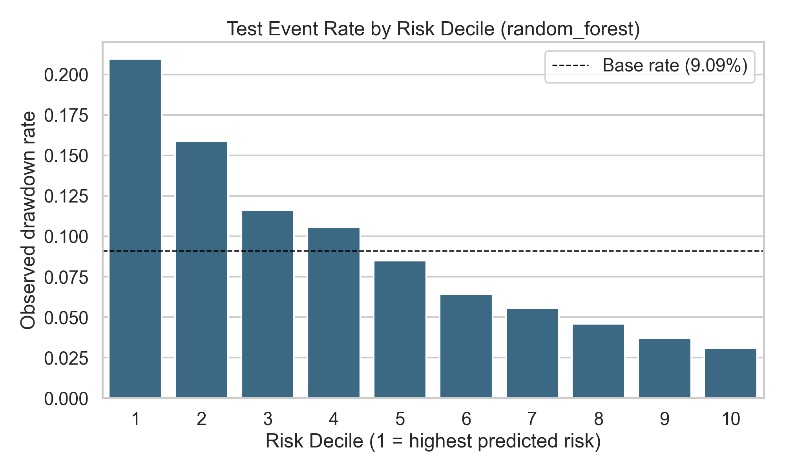
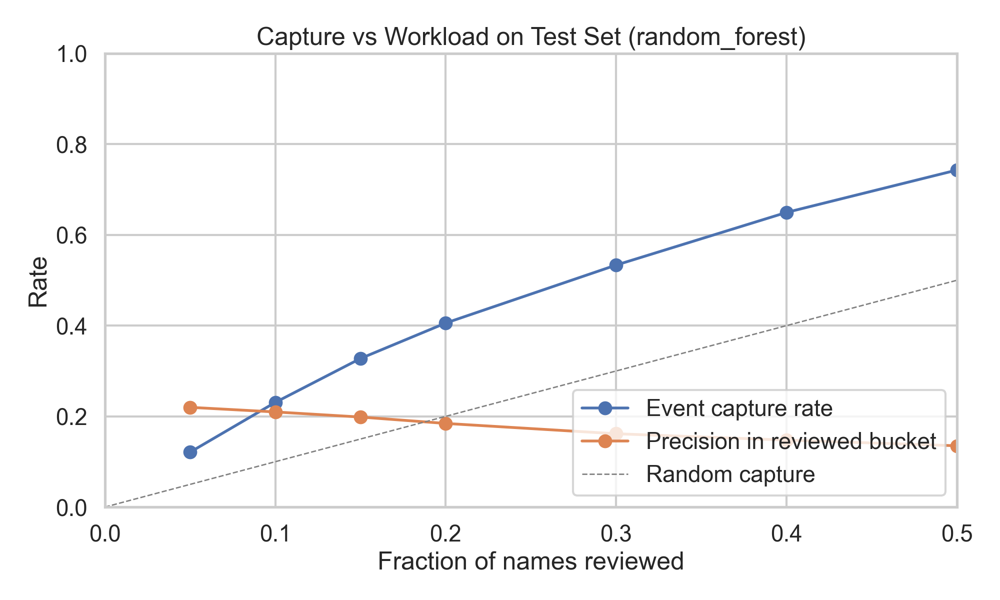

# Temporal ML Pipeline for Equity Drawdown Risk

Time-aware machine learning pipeline for predicting whether an equity will experience a **20%+ drawdown in the next 60 trading days**.

The project builds a multi-source dataset (price action, benchmark-relative features, short interest, fundamentals), trains multiple models with temporal safeguards, and evaluates both statistical quality (ROC/PR) and practical ranking value (top-decile lift).

## 10-Second Snapshot

- Test top-decile lift (random forest): **2.31x**
- The highest-risk decile is materially enriched for future 20%+ drawdowns.





## Purpose

This repo answers a practical risk-screening question:

- Which stocks are most likely to suffer a major drawdown soon?
- Can we rank a universe of stocks so risk teams can focus on the top risk decile?

The target is:

- `label_drawdown_20pct_60d` = 1 if the stock falls 20% or more at any point in the next 60 trading days, else 0.

## What You Built

You implemented an end-to-end, production-style research pipeline:

1. Universe + price ingestion
2. Feature engineering + target labeling
3. Optional alternative data ingestion (short interest + fundamentals)
4. Time-aware model training and evaluation
5. Visualization scripts for fold stability and lift performance

## Repository Structure

- `download_yfinance_prices.py`  
  Builds the equity universe (S&P 500 + TSX 60 + benchmarks/sector ETFs) and downloads OHLCV data.

- `build_modeling_dataset.py`  
  Creates technical and benchmark-relative features, computes forward drawdown labels, and writes clean modeling datasets.

- `fetch_short_interest.py`  
  Downloads FINRA short-interest data (US coverage) and saves a cleaned parquet.

- `fetch_fundamentals.py`  
  Downloads quarterly fundamentals via yfinance, applies reporting lag logic, and outputs point-in-time-safe features.

- `train_drawdown_risk_models.py`  
  Merges all feature blocks, applies temporal safeguards, runs walk-forward CV + final split training, and writes model artifacts/metrics.

- `model_visualizations.py`  
  Creates performance visuals (fold lift, fold ROC/PR, cumulative lift curve).

All scripts are located in `src/`.

## Data Pipeline

### 1) Download universe and prices

`download_yfinance_prices.py`:

- Scrapes live constituents:
  - S&P 500
  - TSX 60
- Maps each symbol to:
  - country
  - sector
  - market benchmark (`SPY` or `XIU.TO`)
  - sector benchmark ETF
- Downloads daily prices (`2016-01-01` to `2025-12-31`) for equities + benchmark symbols

Output:

- `data/metadata/equity_universe_metadata.csv`
- `data/raw/prices_yfinance/*.csv`
- `_downloaded_ok.csv`, `_download_failures.csv`

### 2) Build modeling dataset

`build_modeling_dataset.py`:

- Loads raw per-symbol OHLCV files
- Engineers base and benchmark-relative features
- Computes forward 60-day drawdown target columns
- Exports full and clean datasets

Output:

- `data/processed/stage1_modeling_data_full.csv`
- `data/processed/stage1_modeling_data.csv` (training input)
- `data/processed/stage1_summary.csv`

Note: output filenames still use `stage1_*` naming for compatibility.
Note: `data/processed/stage1_modeling_data.csv` is not committed to this repo
because it is large and reproducible. Generate it locally by running:

```bash
python src/build_modeling_dataset.py
```

### 3) Optional short-interest features

`fetch_short_interest.py`:

- Pulls FINRA consolidated short interest (bi-monthly)
- Standardizes schema and saves parquet

Output:

- `data/raw/short_interest/finra_short_interest_raw.parquet`

### 4) Optional fundamentals features

`fetch_fundamentals.py`:

- Fetches quarterly income/balance-sheet data via yfinance
- Builds features like margins, leverage, coverage, growth deceleration
- Applies reporting lag to reduce lookahead risk
- Preserves `.TO` symbols so Canadian rows can merge correctly downstream

Output:

- `data/raw/fundamentals/fundamentals_features.parquet`

## Modeling Approach

`train_drawdown_risk_models.py` includes:

- Feature blocks:
  - 70 base numeric features
  - regime flags
  - cross-sectional rank features
  - optional short-interest + fundamentals
- Temporal leakage controls:
  - training boundary embargo
  - overlapping-label purge (stride subsampling)
  - expanding walk-forward CV
- Model families:
  - Classifiers: Dummy, Logistic Regression, Random Forest, HistGradientBoosting, RF+LR ensemble
  - Regressors (rank by `-predicted_drawdown`): Ridge, RF Regressor, HGB Regressor

Outputs:

- `results/stage1/tables/stage1_metrics.csv`
- predictions per model/split in `results/stage1/tables/*_predictions.csv`
- CV summary: `results/stage1/tables/walk_forward_cv_results.csv`
- feature importances / coefficients / threshold sweeps / lift files

## Your Current Results (From Latest Run)

Data and features:

- Rows: `1,033,811`
- Numeric features: `105`

Coverage diagnostics:

- Short interest coverage:
  - Overall: `87.80%`
  - US: `97.30%`
  - CA: `0.00%` (expected: FINRA is US-focused)
- Fundamentals coverage:
  - Overall: `8.44%`
  - US: `8.43%`
  - CA: `8.53%`

Walk-forward CV (classifier averages):

- Best average by PR AUC: `ensemble_rf_lr`  
  ROC `0.6799`, PR `0.1636`, lift@10% `2.6206x`

Final split:

- Best classifier by validation PR AUC: `random_forest`
- `random_forest` test metrics:
  - ROC AUC: `0.6826`
  - PR AUC: `0.1678`
  - lift@10%: `2.31x`

Interpretation: the model is substantially better than random ranking for drawdown screening and shows strong top-decile enrichment.

## Visualizations

Run:

```bash
python src/model_visualizations.py
```

Generates:

- `results/stage1/plots/01_top_decile_lift_by_fold.png`
- `results/stage1/plots/02_fold_by_fold_roc_pr.png`
- `results/stage1/plots/03_test_cumulative_lift_curve.png`
- `results/stage1/plots/04_test_decile_event_rate.png`
- `results/stage1/plots/05_test_capture_vs_workload.png`
- `results/stage1/reports/business_impact_summary.md` (short operational write-up)

## Fresh Clone Quickstart

From a fresh clone, run:

```bash
python -m pip install -r requirements.txt
make pipeline
```

This will:

1. download the universe and price history,
2. generate `data/processed/stage1_modeling_data.csv`,
3. fetch short-interest and fundamentals,
4. train/evaluate models,
5. generate plots and business-impact summary.

If you only want training/plots after data already exists:

```bash
make train
make visuals
```

## How to Run the Full Pipeline

From repo root:

```bash
# 1) Build universe + prices
python src/download_yfinance_prices.py

# 2) Build modeling dataset
python src/build_modeling_dataset.py

# 3) Optional: short interest
python src/fetch_short_interest.py

# 4) Optional: fundamentals (use --overwrite to refresh)
python src/fetch_fundamentals.py --overwrite

# 5) Train and evaluate (concise logs)
python src/train_drawdown_risk_models.py

# 6) Full detailed logs
python src/train_drawdown_risk_models.py --verbose

# 7) Plot results
python src/model_visualizations.py
```

## Environment

Core dependencies:

- `python`
- `pandas`
- `numpy`
- `scikit-learn`
- `matplotlib`
- `seaborn`
- `requests`
- `yfinance`
- parquet engine (`pyarrow` or equivalent)

If needed:

```bash
pip install pandas numpy scikit-learn matplotlib seaborn requests yfinance pyarrow
```

## Caveats and Notes

- Universe is scraped from current index constituents, so historical survivorship bias can remain.
- Short interest source is US-centric (FINRA), so Canadian short-interest coverage is expected to be limited unless CIRO/IIROC data is integrated.
- Fundamentals coverage is currently sparse; models still perform well but this feature block may have limited contribution unless coverage is improved.
- `results/stage1/tables/` is kept aligned with artifacts produced by the current training pipeline (stale legacy tuning exports were removed).

## Accomplishments Summary

- Built a complete multi-source temporal ML pipeline
- Added leakage-aware training design (embargo, purging, walk-forward CV)
- Achieved strong risk ranking performance (`~2.31x` lift at top decile on test)
- Added diagnostics for feature merge coverage by country
- Added publication-ready performance visualizations
